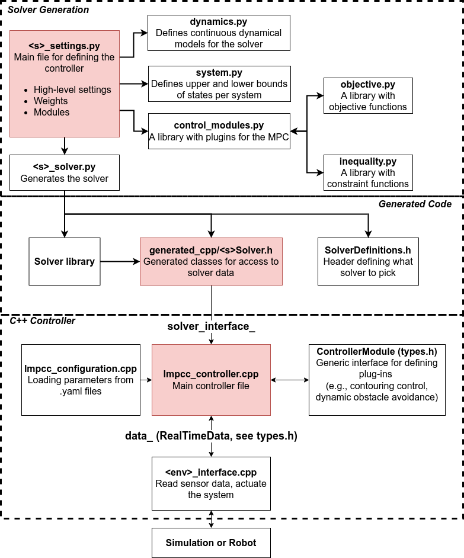

.. Roadmap documentation master file, created by
   sphinx-quickstart on Fri Apr 22 17:23:23 2022.
   You can adapt this file completely to your liking, but it should at least
   contain the root `toctree` directive.

LMPCC
===================================

   Diagram of the code in this repository.

.. toctree::
   :maxdepth: 2
   :caption: Documentation

   pages/getting_started.rst
   pages/overview.rst
   pages/solver_architecture.rst
   pages/controller_code.rst
   pages/system_specific.rst
   pages/tools.md
   pages/changelog.md

Indices and tables
==================

* :ref:`genindex`
* :ref:`modindex`
* :ref:`search`

