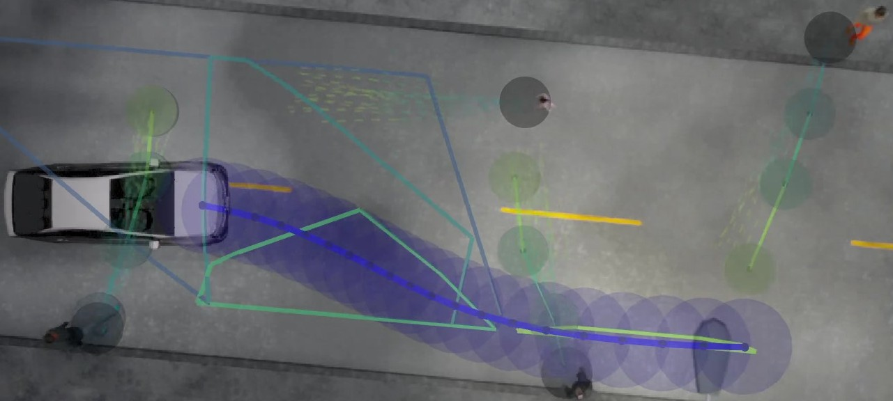
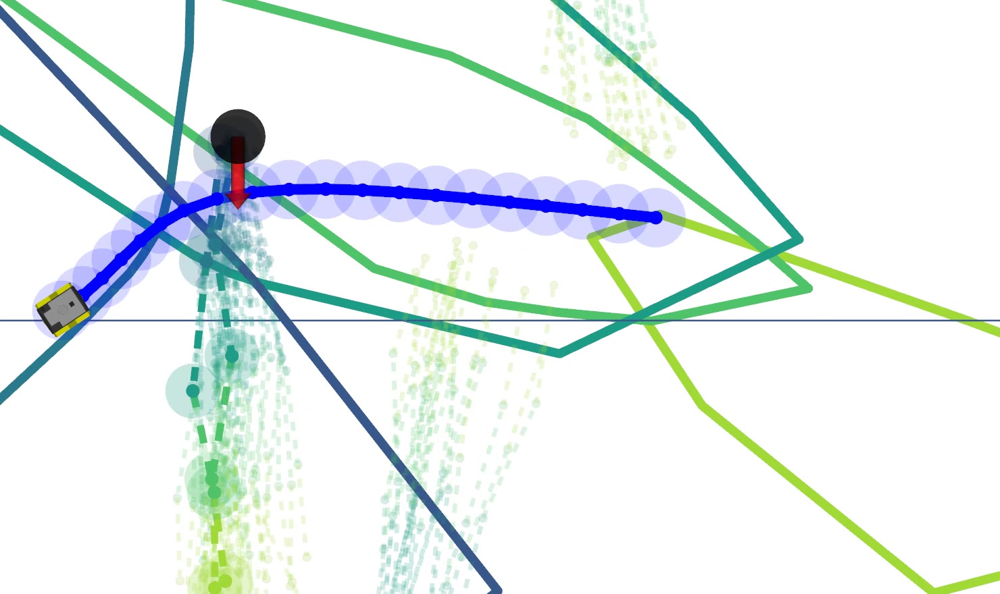
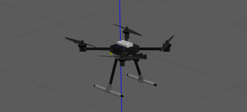
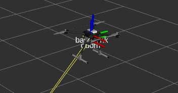

.. _implemented-systems:

Implemented Systems
=============================================

CARLA Simulator
++++++++++++++++++++++++++++++++++++++++++
The CARLA simulator is a simulator for self-driving vehicles that includes pedestrians, cyclists and other vehicles. Details on how to use it are given below.

.. Note::
	We are using CARLA version 0.9.10.1

Installation
-------------------------------------------
Download Carla 0.9.10.1: https://github.com/carla-simulator/carla/releases/tag/0.9.10.1

Extract the contents in a convenient location. You need to clone both the CARLA ROS Bridge (our fork) and a custom simulation tool package to your src directory.

.. code-block:: bash

	git clone --recurse-submodules  https://github.com/oscardegroot/ros-bridge.git
	git clone https://github.com/oscardegroot/carla_simulation_tools
	cd ros-bridge
	git checkout older_carla

.. warning::
	
	The simulation package is currently PRIVATE. You need to request access (o.m.degroot@tudelft.nl)

Install dependencies::

	sudo apt-get install ros-melodic-ackermann-msgs
	sudo apt-get install ros-melodic-derived-object-msgs
	pip install simple_pid pygame networkx

In order to run CARLA you need to add it to your Python path. Depending on your Python version, this will either be Python2.7 or Python3.7. To do so, add these aliases to the your ``~/.bashrc``. Note that you need to replace `<path_to_carla>` with the path to your carla installation and ``-py2.7`` with ``-py3.7`` if you are running Python 3.::

	alias load_carla="export PYTHONPATH="<path_to_carla>/PythonAPI/carla/dist/carla-0.9.10-py2.7-linux-x86_64.egg:<path_to_carla>/PythonAPI/carla/";source devel/setup.bash"
	alias carla="bash <path_to_carla>/carla_0_9_10_1/CarlaUE4.sh Town03 -benchmark -fps=20 -quality-level=Low -windowed -ResX=500 -ResY=500 -opengl4"
	alias cdcarla="cd <your_ros_ws> && source devel/setup.bash && load_carla"

You can also add ``cdcarla`` directly to always open your terminals in this workspace with CARLA and ROS sourced.

You can test the simulator by opening an empty terminal, running::
	
	cdcarla
	carla

You should see a small CARLA window pop-up with a roundabout visualized.

Running the Simulator
---------------------------------------------
Make sure you set the system to CARLA (i.e., ``./01_set_system.sh Carla``). Generate a solver and build LMPCC (see :ref:`getting-started`).

A launch file is provided for the CARLA simulator (``carla_lmpcc.launch``), which starts

- The carla simulation tool (spawning pedestrians, vehicles, etc.)

- A node for low-level PID control of the throttle pedal

- The LMPCC controller

To run a simulation, open two terminals (i.e., in terminator) and run ``cdcarla`` in all of them. Execute in parallell

- ``carla``

- ``roslaunch lmpcc carla.launch``

.. Note::

	You can change the environment by changing the ``scenario`` argument in ``carla.launch``. You can create your own scenarios as well using the ``carla_simulation_tools`` package.

After launching the first simulation, CARLA keeps running, it does not need to be restarted. The lmpcc will need to be restarted when you modify the code.

Jackal Simulator
++++++++++++++++++++++++++++++++++++++++
The Jackal simulator is a simple simulation of the ClearPath Jackal mobile robot using Gazebo. It is provided by ClearPath. 

We provide a fork that includes a simulator for noisy pedestrians.

.. warning::
	
	The jackal_simulator package is currently PRIVATE. You need to request access (o.m.degroot@tudelft.nl)

.. code-block:: bash

	git clone --recurse-submodules https://github.com/oscardegroot/jackal_simulator.git

Make sure you set the system to JackalSimulator (i.e., ``./01_set_system.sh JackalSimulator``). Generate a solver and build LMPCC (see :ref:`getting-started`).

Then to start the simulator simply launch ``roslaunch lmpcc jackalsimulator.launch``.

Drones
++++++++++++++++++++++++++++++++++++++++++
For using this package with drones, take a look at the `Drone Toolbox repository <https://github.com/cor-drone-dev/drone_toolbo>`_. This toolbox contains all `installation instructions <https://github.com/cor-drone-dev/drone_toolbox#installation-instructions>`_ and `run <https://github.com/cor-drone-dev/drone_toolbox#run-instructions>`_ instructions required to start the simulation.

The following figures illustrate the visualization of the HoverGames drone flying in Gazebo and RViZ, respectively:

	HoverGames drone in Gazebo

	HoverGames drone in RViZ

Roboat
++++++++++++++++++++++++++++++++++++++++
.. Note::
	The Roboat simulation is currently not being maintained.

Before you are able to run the simulation of the Roboat. You must have the ``roboat_social_simulator`` package. Ask Jitske de Vries or anyone at the Roboat project from AMS Institute if you can get access to that repository.

Make sure that the ``roboat_social_simulator/config/social_simulator.yaml`` file defines the right scale and all parameters in ``dynamics.py``, ``roboat_predictive_config_parameter.yaml`` and ``systems.py`` are corresponding to the parameters in the roboat social simulator config file.

Then you are able to run the simulation through: ``roslaunch lmpcc roboat_simulation.launch`` for the simulation or ``roslaunch lmpcc roboat_realworld.launch`` to run with the real quarter scale boat.
Tune the weights (especially ``Kv``, ``Kcontour`` and ``Klag``) in the dynamic reconfigure rviz display to obtain a good path.

.. 

..   
.. 