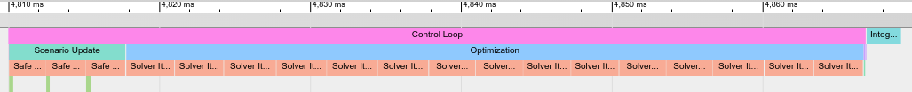

Tools
====================================
Three main tools are provided with the package in lmpcc_tools

Visualization (ROS Visuals)
++++++++++++++++++++++++++++++++++++
A simplified wrapper class for drawing visuals. 

.. figure:: ../images/jackal_simulator.jpg
	:width: 1000px

	Example visuals created by this tool.

Visualizations on each topic are initialized by making a ``RosTools::ROSMarkerPublisher``, for example defining in the header::

	#include <memory>
	#include <ros_tools/ros_visuals.h>

	std::unique_ptr<RosTools::ROSMarkerPublisher> ros_markers_;

Then in the initialization create the class on your desired topic::

	ros_markers_.reset(new RosTools::ROSMarkerPublisher(nh, "my_topic", "map", <expected_maximum_markers>)

Then you can use the visuals as in the examples below.

**Drawing a Line**

.. code-block:: cpp

	RosTools::ROSLine &line = ros_markers_->getNewLine();
	line.setScale(0.1, 0.1); // Set the thickness
	line.setColorInt(val, range); // Set its color using a Viridis map index (val / range)

	geometry_msgs::Point p1, p2; // Define two points

	/** @todo: define p1 and p2 for your line */

	// p1.x =
	// p1.y =

	// p2.x =
	// p2.y =

	line.addLine(p1, p2); // Add the line (you can add more than one line)

	ros_markers_->publish(); // Publishes AND removes the added visuals

**Drawing a Point**

.. code-block:: cpp

	RosTools::ROSPointMarker &point = ros_markers_->getNewPointMarker("CUBE");
	point.setScale(0.15, 0.15, 0.1e-3); // Set the size of the marker
	point.setColorInt(val, range); // Set its color using a Viridis map index (val / range)

	geometry_msgs::Point p1; // Define a point (can also be a Eigen::Vector3d)

	/** @todo: define the point */
	// p1.x =
	// p1.y =
	// p1.z =

	point.addPointMarker(p1); // Add the line (you can add more than one line)

	ros_markers_->publish(); // Publishes AND removes the added visuals

**Drawing Many Points**

.. code-block:: cpp

    RosTools::ROSPointMarker &points = ros_markers_->getNewMultiplePointMarker("CUBE");
    points.setScale(0.15, 0.15, 0.1e-3); // Set the size of the marker
    points.setColorInt(val, range); // Set its color using a Viridis map index (val / range)

    geometry_msgs::Point p1; // Define a point (can also be a Eigen::Vector3d)

    /** @todo: define the point */
    // p1.x =
    // p1.y =
    // p1.z =

    points.addPointMarker(p1); // Add the line (you can add more than one line)
    points.finishPoints(); // When drawing multiple points this is necessary

    ros_markers_->publish(); // Publishes AND removes the added visuals

.. hint::
	If you want to draw more than one visual on a topic, make sure to call ``ros_markers_->publish()`` only once.

Data Saver
++++++++++++++++++++++++++++++++++++
The data saver is a tool to export data from C++ to txt format. A function to load the output data into a Matlab struct is provided by ``lmpcc/matlab_exports/LoadROSData``.

To use the data saver, create an instance in the header::

	#include <ros_tools/data_saver.h>
	RosTools::DataSaver data_saver_;        /* Used to store runtime data */

Data can then be added using ``data_saver_.AddData(<data_name>, <data_value>);``, for example::

	data_saver_.AddData("radius", r);
	data_saver_.AddData("position", pose);

Only ``double``, ``int`` and ``Eigen::Vector2d`` variables are supported. To save the data to file use::
	
	data_saver_.SaveData("mydata");

A file ``mydata.txt`` will be created in ``lmpcc/matlab_exports/data``. To read the file in Matlab use::

	LoadROSData("<path_to_lmpcc>/lmpcc/matlab_exports/data/mydata.txt")

Profiling
++++++++++++++++++++++++++++++++++++
A tool for profiling the computation times of the controller including a visualization. To profile a function use the macro::

	PROFILE_FUNCTION();

To profile a scope use::

	PROFILE_SCOPE(<name>);

Where the scope can be named for identification.

To visualize the profiling data after running:

* Open Chrome and go to: ``chrome://tracing/``

* Click Load and navigate to ``lmpcc/profiling/lmpcc_profiler.json``

An example of the visualization is shown below

Monitoring Input Signals (Monitor)
++++++++++++++++++++++++++++++++++++
The Monitor class in `types.h` allows you to track if callbacks are being received. To use it, mark signals as expected in the interface:

.. code-block:: cpp

    monitor_->MarkExpected("State");
    monitor_->MarkExpected("Predictions");

Then in each callback add 

.. code-block:: cpp
	
	monitor_->MarkReceived("State");

where the name corresponds to the name given in the line above. 

.. code-block:: cpp
	
	monitor_->PrintStatus();

will publish the signal status to `/lmpcc/interface_status`, which you can read with a JSK Text Overlay.